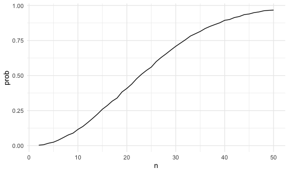
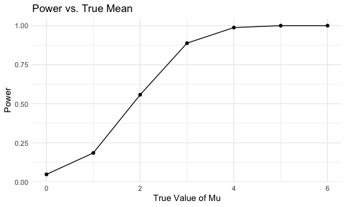
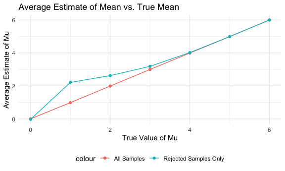
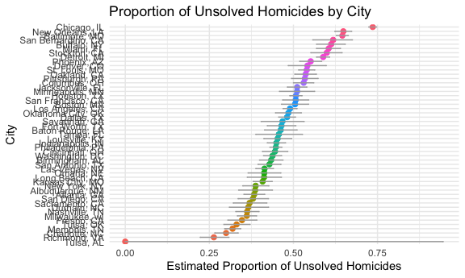

Homework 5
================
Mia Isaacs
2024-11-10

``` r
library(tidyverse)
```

    ## ── Attaching core tidyverse packages ──────────────────────── tidyverse 2.0.0 ──
    ## ✔ dplyr     1.1.4     ✔ readr     2.1.5
    ## ✔ forcats   1.0.0     ✔ stringr   1.5.1
    ## ✔ ggplot2   3.5.1     ✔ tibble    3.2.1
    ## ✔ lubridate 1.9.3     ✔ tidyr     1.3.1
    ## ✔ purrr     1.0.2     
    ## ── Conflicts ────────────────────────────────────────── tidyverse_conflicts() ──
    ## ✖ dplyr::filter() masks stats::filter()
    ## ✖ dplyr::lag()    masks stats::lag()
    ## ℹ Use the conflicted package (<http://conflicted.r-lib.org/>) to force all conflicts to become errors

``` r
library(broom)

knitr::opts_chunk$set(
  echo = TRUE,
  warning = FALSE,
  fig.width = 6,
  fig.asp = .6,
  out.width = "90%"
)

theme_set(theme_minimal() + theme(legend.position = "bottom"))

set.seed(123)
```

# Problem 1

## write birthday function

``` r
bday_sim = function(n) {

  bdays = sample(1:365, size = n, replace = TRUE)
  
  duplicate = length(unique(bdays)) < n

  return(duplicate)
  
}

bday_sim(10)
```

    ## [1] TRUE

## run lots of times

``` r
sim_res = 
  expand_grid(
    n = 2:50,
    iter = 1:10000
  ) |> 
  mutate(res = map_lgl(n, bday_sim)) |> 
  group_by(n) |> 
  summarize(prob = mean(res))
```

## make plot showing prob by group size

``` r
sim_res |> 
  ggplot(aes(x = n, y = prob )) + 
  geom_line()
```



As group size increases, the probability that at least two people in the
group share the same birthday also increases. With a group size of 50,
there is almost a 100% chance that two people will share the same
birthday.

# Problem 2

## set design elements

``` r
prob2_sim = function(samp_size = 30, true_mean = 0, true_sd = 5, alpha = .05) {
  
  prob2_df =
    tibble(
      x = rnorm(samp_size, mean = true_mean, sd = true_sd)
    )
  
  ttest_result = tidy(t.test(prob2_df[["x"]], mu = 0)) 
  
  out_df =
    tibble(
      estimated_mean = ttest_result |> pull(estimate),
      p_value = ttest_result |> pull(p.value)
    )
  
  return(out_df)
}

prob2_sim(samp_size = 30, true_mean = 1)
```

    ## # A tibble: 1 × 2
    ##   estimated_mean p_value
    ##            <dbl>   <dbl>
    ## 1          0.205   0.835

## generate datasets

``` r
sim_results =
  expand_grid(
    true_mu = 0:6,
    iter = 1:5000
  ) |> 
  mutate(
    ttest_result = map(true_mu, ~prob2_sim(samp_size = 30, true_mean = .x, true_sd = 5))
  ) |>
  unnest(ttest_result)

sim_results |> 
  group_by(true_mu) |> 
  summarize(
    avg_mean = mean(estimated_mean, na.rm = TRUE),
    p_value = mean(p_value,  na.rm = TRUE),
    .groups = "drop"
  )
```

    ## # A tibble: 7 × 3
    ##   true_mu avg_mean   p_value
    ##     <int>    <dbl>     <dbl>
    ## 1       0  0.00538 0.504    
    ## 2       1  0.988   0.345    
    ## 3       2  1.99    0.122    
    ## 4       3  3.00    0.0236   
    ## 5       4  3.99    0.00314  
    ## 6       5  4.99    0.000287 
    ## 7       6  6.00    0.0000310

## calculate power

``` r
alpha = 0.05 

power_results =
  sim_results |> 
  group_by(true_mu) |> 
  summarize(
    power = mean(p_value < alpha),
    avg_est_mu = mean(estimated_mean),
    avg_est_reject = mean(estimated_mean[p_value < alpha])
  )
```

## plot power vs. true mean

``` r
power_results |> 
  ggplot(aes(x = true_mu, y = power)) +
  geom_line() +
  geom_point() +
  labs(
    title = "Power vs. True Mean",
    x = "True Value of Mu",
    y = "Power"
  )
```



As effect size increases, power increases. We see an increase in ability
to detect a significant difference as the mean value moves further away
from the null value of 0.

## plot estimated mean vs. true mean

``` r
power_results |> 
  ggplot(aes(x = true_mu)) +
  geom_line(aes(y = avg_est_mu, color = "All Samples")) +
  geom_point(aes(y = avg_est_mu, color = "All Samples")) +
  geom_line(aes(y = avg_est_reject, color = "Rejected Samples Only")) +
  geom_point(aes(y = avg_est_reject, color = "Rejected Samples Only")) +
  labs(
    title = "Average Estimate of Mean vs. True Mean",
    x = "True Value of Mu",
    y = "Average Estimate of Mu"
  )
```



The average estimated mean among tests in which the null was rejected
differs from the true value between the values of 0 and 4, where the
average estimates are higher than the true values. This is because the
power to detect a significant difference is lower when our effect size
is lower, therefore a larger difference between the estimated value and
the true value is required to reject the null hypothesis at lower effect
sizes.

# Problem 3

## read in data

``` r
homicide_data = read_csv("data/homicide-data.csv")
```

    ## Rows: 52179 Columns: 12
    ## ── Column specification ────────────────────────────────────────────────────────
    ## Delimiter: ","
    ## chr (9): uid, victim_last, victim_first, victim_race, victim_age, victim_sex...
    ## dbl (3): reported_date, lat, lon
    ## 
    ## ℹ Use `spec()` to retrieve the full column specification for this data.
    ## ℹ Specify the column types or set `show_col_types = FALSE` to quiet this message.

``` r
summary(homicide_data)
```

    ##      uid            reported_date       victim_last        victim_first      
    ##  Length:52179       Min.   : 20070101   Length:52179       Length:52179      
    ##  Class :character   1st Qu.: 20100318   Class :character   Class :character  
    ##  Mode  :character   Median : 20121216   Mode  :character   Mode  :character  
    ##                     Mean   : 20130899                                        
    ##                     3rd Qu.: 20150911                                        
    ##                     Max.   :201511105                                        
    ##                                                                              
    ##  victim_race         victim_age         victim_sex            city          
    ##  Length:52179       Length:52179       Length:52179       Length:52179      
    ##  Class :character   Class :character   Class :character   Class :character  
    ##  Mode  :character   Mode  :character   Mode  :character   Mode  :character  
    ##                                                                             
    ##                                                                             
    ##                                                                             
    ##                                                                             
    ##     state                lat             lon          disposition       
    ##  Length:52179       Min.   :25.73   Min.   :-122.51   Length:52179      
    ##  Class :character   1st Qu.:33.77   1st Qu.: -96.00   Class :character  
    ##  Mode  :character   Median :38.52   Median : -87.71   Mode  :character  
    ##                     Mean   :37.03   Mean   : -91.47                     
    ##                     3rd Qu.:40.03   3rd Qu.: -81.76                     
    ##                     Max.   :45.05   Max.   : -71.01                     
    ##                     NA's   :60      NA's   :60

The homicide_data includes 52179 observations and 12 variables.
Variables include city id, reported date, victim first and last name,
race, age, sex, city, state, latitude, longitude, and disposition.

## create city state variable and summarize

``` r
homicide_summary = 
  homicide_data |> 
  mutate(city_state = str_c(city, state, sep = ", ")) |> 
  group_by(city_state) |> 
  summarize(
    total_homicides = n(),
    unsolved_homicides = sum(disposition %in% c("Closed without arrest", "Open/No arrest"))
  ) |> 
  ungroup()
```

## proportion unsolved in Baltimore

``` r
baltimore_df =
  homicide_summary |> 
  filter(city_state == "Baltimore, MD") |> 
  summarize(
    test = list(prop.test(unsolved_homicides, total_homicides) |> 
                  tidy())
  ) |> 
  unnest(test) |> 
  select(estimate,conf.low, conf.high)

baltimore_df
```

    ## # A tibble: 1 × 3
    ##   estimate conf.low conf.high
    ##      <dbl>    <dbl>     <dbl>
    ## 1    0.646    0.628     0.663

## run for all cities

``` r
all_cities_df =
  homicide_summary |> 
  group_by(city_state) |> 
  summarize(
    total_homicides = sum(total_homicides),
    unsolved_homicides = sum(unsolved_homicides),
    .groups = "drop"
  ) |> 
  mutate(
    test_results = map2(unsolved_homicides, total_homicides, ~ tidy(prop.test(.x, .y)))
  ) |> 
  unnest(test_results) |> 
  select(city_state, estimate, conf.low, conf.high)

all_cities_df
```

    ## # A tibble: 51 × 4
    ##    city_state      estimate conf.low conf.high
    ##    <chr>              <dbl>    <dbl>     <dbl>
    ##  1 Albuquerque, NM    0.386    0.337     0.438
    ##  2 Atlanta, GA        0.383    0.353     0.415
    ##  3 Baltimore, MD      0.646    0.628     0.663
    ##  4 Baton Rouge, LA    0.462    0.414     0.511
    ##  5 Birmingham, AL     0.434    0.399     0.469
    ##  6 Boston, MA         0.505    0.465     0.545
    ##  7 Buffalo, NY        0.612    0.569     0.654
    ##  8 Charlotte, NC      0.300    0.266     0.336
    ##  9 Chicago, IL        0.736    0.724     0.747
    ## 10 Cincinnati, OH     0.445    0.408     0.483
    ## # ℹ 41 more rows

## plot with estimates for each city

``` r
all_cities_df |> 
  mutate(city_state = fct_reorder(city_state, estimate)) |> 
  ggplot(aes(x = city_state, y = estimate, color = city_state)) +
  geom_point(size = 2) +
  geom_errorbar(aes(ymin = conf.low, ymax = conf.high), width = 0.25, color = "darkgrey") +
  coord_flip() +
  labs(
    title = "Proportion of Unsolved Homicides by City",
    x = "City",
    y = "Estimated Proportion of Unsolved Homicides"
  ) +
  theme_minimal() +
  theme(legend.position = "none")
```


